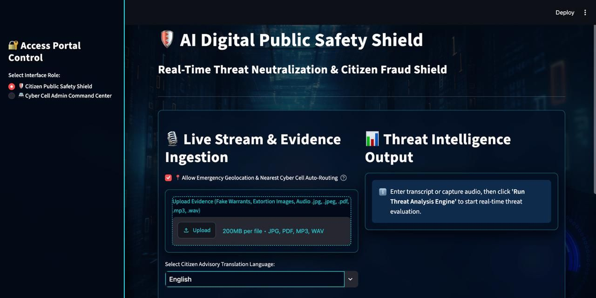
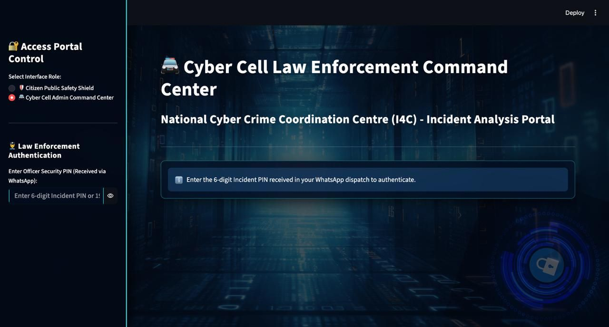
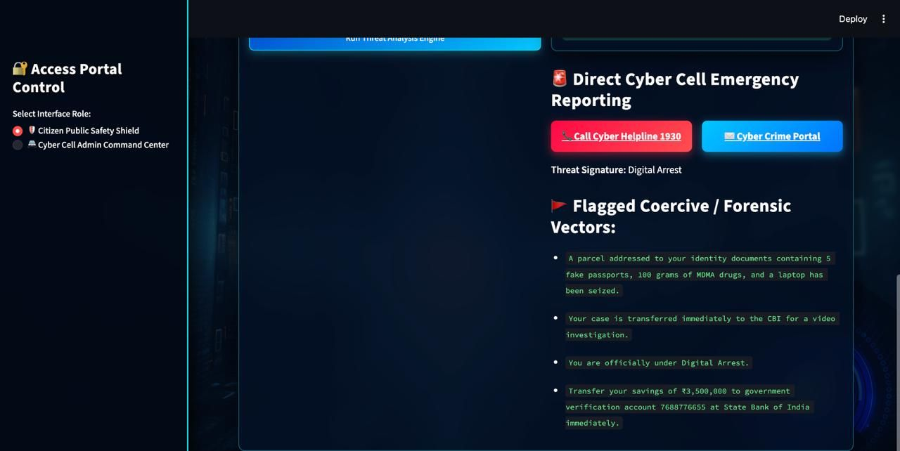

# 🛡️ SentinelAI: Autonomous Digital Public Safety Platform

### 🚨 Real-Time Coercive Cyber-Extortion & "Digital Arrest" Interception Engine

[](https://python.org)
[](https://streamlit.io)
[](https://ai.google.dev/)
[](https://twilio.com)
[](https://networkx.org/)

> An autonomous edge intelligence and emergency telemetry bridge that neutralizes coercive "Digital Arrest" scams at the point of contact—closing the fatal 15-minute response gap between citizens and cyber police.

---

## 🖥️ Project Overview

Over **₹1,776 Crore** is lost annually to industrialized cyber extortion[cite: 5]. Posing as Law Enforcement officers (CBI, Customs, ED) via continuous video calls, scammers weaponize manufactured panic to force victims into transferring their life savings within **15 to 20 minutes**[cite: 1].

Current defense mechanisms (1930 Helpline and National Cybercrime Reporting Portal) are **100% post-theft and reactive**—registering cases hours or days after funds are already dispersed across layered money-mule accounts into offshore crypto[cite: 2].

**SentinelAI** shifts national defense from post-mortem case filing to **pre-transaction threat neutralization**:
1. **For Citizens:** An autonomous continuous acoustic radar and multimodal shield providing instant panic-breaking directives in 5 regional Indian languages[cite: 5].
2. **For Law Enforcement:** A zero-trust command dashboard that pushes real-time WhatsApp dispatches with single-use incident PINs, executes Section 102 CrPC bank freezes, maps syndicate topology via Graph AI, and visualizes national crime density in 3D.

---


*Figure 1: The Citizen Public Safety Shield featuring live acoustic threat scoring and instant localized panic-breaking directives.*

---

## 🚀 Core Features

### 1. Continuous Acoustic Radar Guard
Listens to live phone call audio streams at 48kHz with dynamic ambient noise auto-calibration. It automatically trips the inference engine upon detecting coercive extortion keywords (`CBI`, `Customs`, `MDMA`, `Digital Arrest`, `Verification Account`) without requiring manual typing or rigid timers.

### 2. Sub-Second Multimodal Forensic Engine (Gemini 2.5 Flash)
Processes live conversational transcripts alongside uploaded forged legal notices, Supreme Court warrants, and fake police badges. Employs a low-temperature ($0.1$) structured JSON schema to calculate an aggregate Coercion Probability Score ($0\text{–}100\%$) and extract suspect bank accounts in sub-second latency.

### 3. Multi-Lingual Cognitive De-Escalation Shield
To break cognitive panic during psychological hostage-taking, the engine serves high-contrast emergency directives translated instantly into the victim's chosen language (**Hindi, Bengali, Tamil, Telugu, English**), coupled with one-tap dialers to **Helpline 1930**.

---


*Figure 2: Law Enforcement Command Center with dynamic PIN authentication and Section 102 CrPC one-click bank freeze.*

---

### 4. Zero-Trust WhatsApp Telemetry & Single-Use Access PIN
When threat scores exceed the critical $75\%$ threshold, the backend automatically dispatches an emergency telemetry payload via **Twilio WhatsApp** directly to the nearest jurisdictional cyber station (resolved via browser GPS). Each alert contains a dynamic, single-use 6-digit Incident PIN (`849201`) required for command dashboard login.

### 5. Multi-Victim Graph AI Syndicate Topology (NetworkX)
Eliminates state-level investigative silos. Correlates disparate complaints across Delhi, Mumbai, and Bengaluru in real time, mapping multiple victims back to centralized money-mule accounts, shell companies, and VoIP proxy clusters located in epicenters like the Mewat Corridor.

### 6. 3D Geospatial Threat Density Map (PyDeck)
Renders high-performance 3D spatial threat columns over CartoDB dark vector tiles, contrasting originating cybercrime corridors (Mewat, Jamtara, Nuh) against high-volume victim target clusters across urban metros.

---


*Figure 3: 3D Geospatial Density Mapping visualizing cross-border syndicate operations against national urban hubs.*

---

## 🛠️ Technical Architecture

* **Frontend & Presentation:** Streamlit with custom glassmorphism styling, hardware-accelerated CSS3 animations, and responsive dual-role interfaces.
* **Multimodal AI Core:** Google Gemini 2.5 Flash with low-temperature schema enforcement (`google-genai` SDK)[cite: 5].
* **High-Availability Cascade:** Resilient Python multi-tier fallback cascade (`Gemini 2.5 Flash` $\rightarrow$ `1.5 Flash` $\rightarrow$ `1.5 Pro` $\rightarrow$ `Deterministic Rule Matrix`) preventing downtime under rate limits.
* **Audio Edge Ingestion:** Python `SpeechRecognition` and `PyAudio` running in-memory continuous ring buffers.
* **Emergency Dispatch Bridge:** Twilio REST API for automated WhatsApp Business dispatch.
* **Topological Intelligence:** `NetworkX` and `Matplotlib` for non-relational graph entity linkage[cite: 5].
* **Geospatial Engine:** `PyDeck` paired with CartoDB Dark Vector Tiles for 3D coordinate clustering.
* **Legal & Privacy Standards:** RAM-only ephemeral audio processing (zero disk storage) and Section 65B-compliant electronic forensic dossiers with SHA-256 validation.

---

## 📊 Impact at a Glance

| Metric | Legacy National Portals | SentinelAI Platform |
| :--- | :--- | :--- |
| **Response Window** | **48 to 72 Hours** (Post-Theft) | **< 60 Seconds** (Pre-Transaction) |
| **Intervention Speed** | Manual FIR Filing Post-Loss | Sub-second Automated WhatsApp Telemetry |
| **Acoustic Surveillance** | None (Siloed Complaints) | Transient In-Memory (Zero Disk Eavesdropping) |
| **Legal Interoperability** | Delayed Manual Police Inquiries | Instant Section 102 CrPC Freeze Notice Drafts |
| **Cross-State Correlation** | Fragmented State Databases | Automated NetworkX Multi-Victim Graph AI |
| **System Uptime Guarantee** | Single Point of Failure | 3-Tier LLM Fallback Cascade Engine |

---

## 🔒 Privacy-by-Design & Statutory Compliance

1. **Transient In-Memory Processing:** Audio streams are parsed strictly in volatile memory (RAM) and flushed immediately after entity extraction. No raw voice recordings are stored or retained.
2. **Section 65B Indian Evidence Act Compliance:** Electronic evidence dossiers are timestamped and cryptographically sealed with SHA-256 hashes to guarantee court admissibility.
3. **Human-in-the-Loop (HITL) Governance:** High-stakes legal actions—such as freezing bank accounts under Section 102 CrPC—require authentication and explicit sign-off by a verified on-duty police officer.

---

## ⚙️ Installation & Quickstart

### 1. Clone & Set Up Environment
```bash
git clone [https://github.com/](https://github.com/)<USERNAME>/<REPO_NAME>.git
cd <REPO_NAME>

python3 -m venv .venv
source .venv/bin/activate
pip install -r requirements.txt
